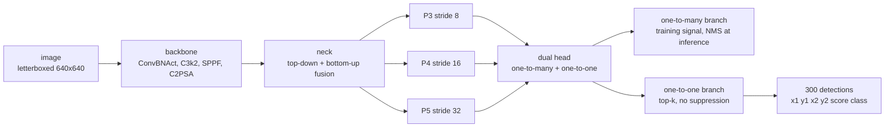
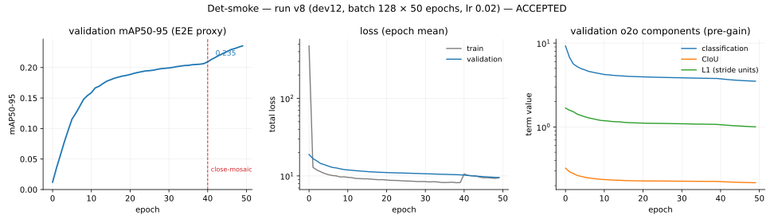
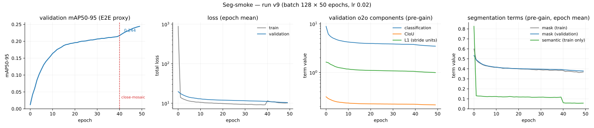
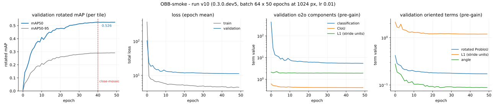
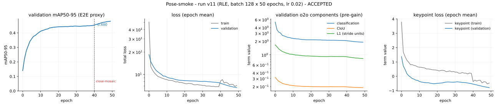

# 🔦 lucid-yolo

> lucid-yolo is an independent, from-scratch PyTorch Lightning implementation of the real-time detection, instance segmentation, and oriented detection methods described in the YOLO26 paper ([arXiv:2606.03748](https://arxiv.org/abs/2606.03748)), plus a keypoint task composed onto the same trunk whose loss and evaluation protocol are taken from RLE (arXiv:2107.11291) rather than from that paper. "YOLO" refers to the family of real-time detectors originated by Redmon et al. (2016). This project is not affiliated with, endorsed by, or derived from Ultralytics or its codebase. No Ultralytics source code, configurations, or model weights were consulted or used. See docs/PROVENANCE.md.

**A modern YOLO, written out in full, with its homework shown.** Every mechanism in the paper — the NMS-free end-to-end head, the removal of distribution focal loss, the MuSGD optimizer, the progressive loss schedule, the rotated-box formulation — is implemented here from the published equations, trained, measured, and written up with the numbers it actually produced. Where the papers leave a choice open, the choice is recorded as a numbered assumption instead of buried in the code.

It is a teaching artifact, a research baseline, and a reproduction record at the same time. It is **not** a production detector: every trained tier is the smallest scale for 50 epochs, and no weights ship.

## 🧭 Why this exists

A paper describes a method; a repository ships an implementation; and the gap between the two is where reproduction usually fails. Published detectors are read by thousands of people through a single codebase, so "the method" and "that codebase's choices" become impossible to tell apart — and the parts the paper never specified are exactly the parts nobody can see.

This project rebuilds the methods from the papers alone, deliberately without reading any existing implementation of them, and writes down every point where the papers ran out of instructions. What comes out is three things at once:

- **A test of the claims.** If the NMS-free head really costs 0.6–0.8 AP, an independent implementation should measure something close to that. [It measures 1.11.](#detection--coco-2017-val-5000-images)
- **A map of the underdetermined.** 73 numbered assumptions — the mask crop frame, the angle convention, the head's initialization bias — each one a place where two faithful implementations could legitimately diverge. See [`docs/ASSUMPTIONS.md`](docs/ASSUMPTIONS.md).
- **A codebase you can read.** No config DSL between you and the architecture, one mechanism per module, and every module citing the equation it implements.

**Non-goals**, stated so nothing here is mistaken for them: matching the paper's headline accuracy (that needs a training budget this project does not have), shipping weights for production use, or being faster than the reference implementation. What is claimed is fidelity of *method*, with the evidence attached.

## 👥 Who this is for

| You are | Start here | What you get |
| -- | -- | -- |
| **A student entering computer vision** | [How a modern YOLO works](#how-a-modern-yolo-works) | One readable path from image to detections, with each block, loss and decode step in its own typed module — no config DSL to decode first |
| **An applied ML engineer** | [Quickstart](#quickstart) | Four commands: train, evaluate, predict, draw. Lightning underneath, so your callbacks, loggers and accelerators work as they already do |
| **A researcher reproducing results** | [What was reproduced](#what-was-reproduced) | Exact recipes, the run behind every number, the criteria each tier had to clear, and the deviations from the paper stated as deviations |
| **A researcher building on top** | [Customizing it](#customizing-it) | Five scales over one topology, losses and assigners as separate modules, and a frozen-golden gate that tells you when a change moved something it should not have |

<a id="how-a-modern-yolo-works"></a>

## 🧠 How a modern YOLO works

One image, one forward pass, and **two** ways of reading the same output:



The interesting part is the **one-to-one branch**. A classical detector predicts many boxes per object and deletes the duplicates afterwards with non-maximum suppression — an operation that is not a neural network, does not export cleanly, and costs latency that grows with the number of objects. Train a second branch to assign exactly one prediction per object, and suppression has nothing left to do: ranking by score and taking the top 300 *is* the decode. The exported graph carries a `TopK` node and no `NonMaxSuppression` node, and a test in this repository asserts exactly that on all four tasks.

The cost is accuracy, and this project measures it rather than assuming it (see below).

Four tasks, one trunk:

| Task | What the head adds | Output row |
| -- | -- | -- |
| **Detection** | nothing — the base case | `[x1, y1, x2, y2, score, class]` |
| **Instance segmentation** | mask coefficients per detection, plus a shared prototype bank the coefficients combine | the detection row, plus a mask cropped to its own box |
| **Oriented detection** | one angle per detection, and boxes that turn | `[cx, cy, w, h, theta, score, class]` — a rotated rectangle, not an upright one |
| **Keypoints** | `K` points per detection, and a normalizing flow that learns what a plausible error looks like instead of assuming it | the detection row, plus `K` `(x, y)` points |

The fourth is **keypoints, not pose**: `K` is a constructor argument the way the class count is, and nothing in the head, the loss or the decode path knows what a point means. Human pose is the instantiation the shipped checkpoint trained on; the wiring gate runs a 7-point synthetic symbol schema instead. It is also the one task not drawn from the YOLO26 paper: the loss and evaluation protocol come from RLE (arXiv:2107.11291), composed onto the same trunk, and no paper on the allowlist publishes a keypoint architecture or parameter table to check this head against.

Every module names the equation it implements and the assumption it rests on. `docs/ASSUMPTIONS.md` is the list of every place where the papers did not determine an answer and this project had to choose one — 73 of them, each with what was chosen, why, and what would falsify it.

<a id="what-was-reproduced"></a>

## 📊 What was reproduced

Four tiers have been trained and accepted — detection, instance segmentation, oriented detection and keypoints — each at the **n scale for 50 epochs on one GPU**. That is a smoke tier: enough to show a mechanism works end to end, far short of the paper's own training budget. Read every number below as "this implementation, trained small" — not as a claim about the paper's headline table.

### Detection — COCO 2017 val, 5000 images

| weights | decode path | mAP50-95 | mAP50 | mAP75 |
| -- | -- | -- | -- | -- |
| EMA | NMS | **25.30** | 38.12 | 26.94 |
| EMA | end-to-end (no NMS) | 23.84 | 36.00 | 25.15 |
| raw | NMS | 25.33 | 38.45 | 27.05 |
| raw | end-to-end (no NMS) | 24.23 | 36.72 | 25.82 |

**The claim this tier exists to test.** The paper reports the NMS-free path costing 0.6–0.8 AP against the NMS path. This run measures **1.11 AP** on raw weights and 1.46 on EMA — the right sign, the right order of magnitude, wider than published. Whether that gap closes at longer schedules is an open question the report records rather than explains away.



### Instance segmentation — COCO 2017 val

| criterion | required | observed |
| -- | -- | -- |
| box mAP50-95 | > 25 (the detection floor, unchanged) | **26.12** EMA-NMS |
| mask-to-box ratio | segm mAP50-95 ≥ 0.65 × box mAP50-95 | **0.728** NMS, 0.732 end-to-end |
| wiring gate | train mask IoU ≥ 0.7 | **0.8146** |

The ratio is bounded above by construction — every mask starts from a box this same model predicted and is cropped to it — so the question is only how far below, and where the loss comes from. It is **0.879** at IoU 0.50 and 0.667 at IoU 0.75, and across object sizes 0.30 small / 0.70 medium / 0.91 large. The model finds and labels instances about as well as its boxes do; it pays at the boundary, and most where the prototype grid is coarsest relative to the object.



### Oriented detection — DOTA-v1.0 val, tiled

| weights | rotated mAP50-95 | rotated mAP50 |
| -- | -- | -- |
| EMA | **0.2914** | 0.5242 |
| raw | 0.2867 | 0.5140 |

**Read this one carefully: it is per tile.** Aerial images are cut into overlapping 1024 px tiles, and an object crossing a seam is counted in each tile that saw it, so this figure is comparable to nothing published. The same checkpoint re-scored through the whole-image merge (roadmap 111) reports **0.3146** / 0.5484 — every figure rises rather than falls, and the report explains why that is the cap-lifting rather than the merge.



### Keypoints — COCO 2017 val, `person_keypoints`

| decode path | OKS AP | OKS AP50 | box mAP50-95 |
| -- | -- | -- | -- |
| end-to-end (no NMS) | **0.2738** | 0.6094 | 0.5030 |
| NMS | 0.2688 | 0.6066 | 0.5119 |

**The claim this tier exists to test is not the OKS number.** RLE's argument is that a *learned* residual density earns the accuracy, rather than the reparameterization and bounded per-point scale it ships alongside — and one figure cannot separate those. So this tier ran twice, on configs differing in exactly one line, and the control is the paper's own published flow-free ablation: **0.2738 against 0.2527** end-to-end OKS AP, the same direction as the source paper's own 70.5-vs-67.4. The absolute figures are far below either, and were never the criterion.



### What is gated rather than claimed

- **Architecture fidelity**: parameter and FLOP counts for all five scales are held against the paper's own tables, as a test, on every commit — detection against Table 7 within ±2% params (n: 2.4M/5.4G through x: 55.7M/193.9G), instance segmentation against Table S9 within ±3%, oriented detection against Table S11 within ±3.5% at 1024 px on DOTA's 15 classes, and all three within ±5% FLOPs. The oriented tolerance is wider because it is where the angle-stem width is inferred rather than published, and it is stated as such rather than as parity (A20 stays open). Keypoints are the one task with no published table to check — none of the papers describes a keypoint architecture at all — so that head is held against this project's own frozen goldens instead.
- **Regression**: 34 frozen golden metric files, one set per released minor from 0.2 through 0.7, re-verified beside the 9 live ones on every run of `make gate` — a later release may never silently regress an earlier one's numbers.
- **The suite**: every test offline — no network, no dataset, no GPU required, and the doctests in `src/` and `scripts/` run with it.

Full write-ups with the exact commands as run, the failures along the way, and what each tier does *not* claim: **docs/REPRODUCTION_REPORT.md**. Per-task model cards, including intended use and limitations: **docs/model_cards/**.

<a id="quickstart"></a>

## 🚀 Quickstart

```bash
git clone … && make setup          # a dev checkout, with the gates — the install that works today
```

**There is no `pip install lucid-yolo` line here, and that is deliberate.** PyPI carries 26 distributions of this project and every one of them is a `.devN` pre-release that `pip` skips unless asked, the newest a `0.5.0.dev2` snapshot two minors behind this tree — so the bare command resolves to nothing and `--pre` resolves to something older than what this README describes. The current release cannot be uploaded at all: `fuse-augmentations` is a runtime dependency pinned to a git commit, and a direct reference is legal to build and install and illegal to upload to PyPI (docs/DECISIONS.md, D20). The day a `fuse-augmentations` 0.12 reaches PyPI that pin becomes a `>=0.12,<0.13` range and this section gets its install line back.

Four commands cover a whole tier. Datasets are never committed and never downloaded by tests — docs/DATASETS.md says where COCO 2017 and DOTA-v1.0 come from.

```bash
# 1. get data, and check the layout before spending GPU hours on it
lucid-data download --data_root /data/coco --splits '[train,val]' --verify true
lucid-data check    --data_root /data/coco

# 2. train — one config per tier, packaged inside the wheel
lucid-yolo fit --config det_nano_smoke.yaml --data.data_root /data/coco

# 3. score a checkpoint on the protocol its own task names
lucid-eval --checkpoint runs/det.ckpt --data_root /data/coco --output report.json

# 4. predict on one image
lucid-predict --checkpoint runs/det.ckpt --image street.jpg
```

Swap `det_nano_smoke.yaml` for `seg_nano_smoke.yaml`, `obb_nano_smoke.yaml` or `pose_nano_smoke.yaml` and the same four commands train and score the other three tasks. docs/TRAINING.md carries the full recipe per tier, including the batch-size scaling and the one setting that matters most on a hosted runtime.

**Releases publish no trained weights** (a deliberate policy — see docs/DECISIONS.md, D14), so every command above takes a checkpoint you trained.

### Seeing what the model saw

```bash
python scripts/draw_predictions.py runs/det.ckpt street.jpg --output street_det.png
python scripts/draw_predictions.py runs/seg.ckpt street.jpg --output street_seg.png --conf-threshold 0.4
python scripts/draw_predictions.py runs/obb.ckpt aerial.png --output aerial_obb.png --img-size 1024
```

A detection checkpoint draws boxes, a segmentation one adds each instance's own mask overlay, and an oriented one draws rotated quadrilaterals — never their upright envelopes, which are a different rectangle from the one the model reported. Colour is a function of the class index alone, so two figures of the same scene compare by eye. `matplotlib` is a dev dependency and stays one: the drawing lives in `scripts/`, and installing the library pulls no plotting stack.

<a id="customizing-it"></a>

## 🛠️ Customizing it

The architecture is **typed Python, not a config file** (docs/DECISIONS.md, ADR-001). Configs carry the schedule, the optimizer settings and the loss gains; topology is named by `variant` and lives in the registry. That means a change to the model is a change to code a type checker reads, and a change to a run is a flag.

| You want to change | Touch | Notes |
| -- | -- | -- |
| Model size | `--variant n\|s\|m\|l\|x` | Five rows of depth / width / max-channels over one topology; only `n` has been trained here |
| A building block | `models/blocks.py` | `ConvBNAct`, `Bottleneck`, `C3k`, `C3k2`, `SPPF`, `SpatialAttention`, `PSABlock`, `C2PSA` — each with its own tests |
| The head, or a new task | `models/heads/` | The dual head, the prototype bank and the semantic auxiliary are separate modules |
| A loss term or its weight | `losses/`, or a `--model.*` gain | CIoU, ProbIoU, angle, mask, semantic, and the progressive branch-weight schedule are each their own file |
| Label assignment | `assign/` | Task-aligned assignment, its small-target variant, and the one-to-one assigner |
| The optimizer | `optim/musgd.py` | MuSGD, with Newton–Schulz orthogonalization split out and tested on its own |
| How detections are decoded | `decode/` | The end-to-end top-k path, the NMS path, and the rotated variants |
| Your own dataset | `--data.data_root` | COCO-JSON and YOLO-txt layouts are both read, and the layout is probed rather than declared |

Then run `make gate`. It runs the linters, the type checker, the full offline suite and the frozen goldens — so a change that quietly moved a number you were not editing fails in about two minutes rather than in a training run tomorrow.

## ⚖️ The decisions that shape it

Seven choices explain most of what this repository looks like. Each one is argued in `docs/DECISIONS.md`, and each has evidence behind it rather than only a preference.

**No reference implementation is ever read.** A reproduction that consults the original tests nothing — it inherits the answers, including the ones the paper never gave. So the source list is an allowlist: the papers, and a handful of permissively licensed implementations admitted for diagnostics only, each named with the decision that admitted it ([`PROVENANCE.md`](docs/PROVENANCE.md), D13 / ADR-004). Commit messages cite sources by id, and a hook rejects a commit whose citation does not resolve.

**The architecture is typed Python, never a config file** ([ADR-001](docs/DECISIONS.md)). A YAML topology moves every structural error from the type checker to the first forward pass, and makes "what changed" a diff of strings. Here, five scale rows multiply depth, width and max-channels over one topology, and the run configs carry only schedule, optimizer and loss gains. Evidence that it holds: parameter and FLOP counts for all five scales are gated against the paper's table on every commit.

**Every underdetermined choice becomes a numbered assumption.** When the papers stop short — the mask crop frame, the long-edge angle range, the classifier's prior bias — the choice is written down with what it costs if wrong, and cited from the code that depends on it. That register is what makes a disagreement between this implementation and another *locatable* instead of mysterious ([`ASSUMPTIONS.md`](docs/ASSUMPTIONS.md)).

**The reproduction report is append-only** (D10). A later release corrects an earlier claim by adding to it, never by editing the record away — including the claims that did not survive. The 0.4 consolidation reads all three tiers against each other and its headline result is an *absence*: one quantity all three could have reported in the same units, and only two of them did.

**Releases ship no trained weights** (D14). For the oriented model that is a licence conclusion as well as a policy one — DOTA permits academic use only, so weights trained on it could not ship under this repository's Apache-2.0 terms even if the policy allowed it. What ships instead is the recipe, the report, and the frozen goldens that let you tell whether your run matches.

**The augmentation engine is a dependency, not a chapter** ([ADR-005](docs/DECISIONS.md), D19). Resampling — building a matrix, composing several into one, and sampling the image once instead of interpolating repeatedly — is a general-purpose subject, and keeping a private copy of it meant maintaining the weaker of two implementations of the same thing. It now comes from `fuse-augmentations`, under a boundary written down before any code moved: that package owns how a matrix is built, composed and sampled, and this project owns which numbers go into it — the targets container, the composition order, the paper's augmentation recipe, dataset IO, DOTA tiling, and everything from the assigner inward. The claim that the swap changed behaviour and not geometry is checked rather than asserted: the three delegation commits moved exactly one image-mean golden and no coordinate golden at all.

**Dependencies are permissive-only, and audited by what they ship rather than what they say.** The licence gate reads a distribution's declared fields, the licence documents it bundles, *and* the binaries listed in its own `RECORD` — because a wheel can declare BSD-3-Clause, ship a licence file naming no copyleft, and vendor a GPL library anyway. That is not hypothetical: it is why the example in this README is drawn with matplotlib and not the library originally chosen for it (D15, D16).

## 📓 How this project works

Reproducibility here is a process, not a claim, and the process is visible in the repository:

- **`AGENTS.md`** — the execution contract. One work package, one commit, gate green before it lands.
- **`docs/ROADMAP.md`** — every work package, what it does, its definition of done, its status.
- **`docs/PROVENANCE.md`** — every source this implementation is allowed to read, by id. Commit messages cite them.
- **`docs/ASSUMPTIONS.md`** — every choice the papers left open, numbered and cited from the code that depends on it.
- **`docs/DECISIONS.md`** — architecture and policy decisions, with the four ADRs behind them.
- **`docs/RESEARCH_LOG.md`** — fidelity measurements, negative results, and the modeling mistakes worth remembering.
- **`docs/ENGINEERING_LOG.md`** — the same, for repo tooling: CI, packaging, licensing, doc generation. Split from the research log by claim, not by work package.
- **`docs/REPRODUCTION_REPORT.md`** — append-only: a later release corrects an earlier claim by adding to it, never by editing the record away.

The clean-room rule is absolute and it is what makes the reproduction mean anything: no reference implementation of this architecture was read, at any point, by anyone or anything working on this repository. What is permitted — papers, and permissively licensed implementations admitted for diagnostics — is listed in `PROVENANCE.md` with the decision that admitted it.

## 🏷️ Versioning

Perpetual 0.x release train — each 0.MINOR is a gated capability milestone (0.1 detection, 0.2 instance segmentation, 0.3 oriented detection, 0.5 keypoints, and rolling releases in between). No 1.0 is planned: the project tracks a living specification (the paper plus this project's assumption register), and each release freezes its golden metrics; later releases must never regress them. This is a deliberate policy, not an abandonment signal — see docs/DECISIONS.md.

Current release: **0.8.0** — the audit remediations, and the gates that should have caught them. A repository-wide audit opened sixteen rows, and what they have in common is that each defect was invisible to a green gate: an assigner whose one-to-many localization objective was annihilated at `4.12e-09` while every offline golden passed, a merge path that dropped a modality, entry points validating types but not values, and a record that described a three-task repository against four shipped tiers. The gates moved with the fixes — CI now runs `make test` rather than a narrower subset, `goldens/frozen/` carries a digest manifest so a frozen value cannot be edited alongside its tolerance, the accelerator half has a nightly schedule instead of a comment claiming to be one, and the four acceptance floors are enforced where the score is produced rather than once at a prompt. It trains no new tier and publishes no new accuracy figure, but it moves one: the keypoint overfit floor rose from `0.335667` to `0.574728` once the assigner was fixed, which is the first measurement of what that defect cost. The release before it is the augmentation stack leaving this repository (0.7.0).

## 🧰 Development

```bash
make setup   # venv + editable install + pre-commit hooks
make gate    # lint + types + tests + golden regression: the merge gate
```

Contributions follow the same contract the rest of the work does: `AGENTS.md` first, one logical change per commit, `make gate` green, and the source of every design claim cited by id.

## 📜 License

Apache-2.0 (see LICENSE and NOTICE). Dependencies are audited on every commit for copyleft licences — including the binaries a wheel ships without declaring them.
